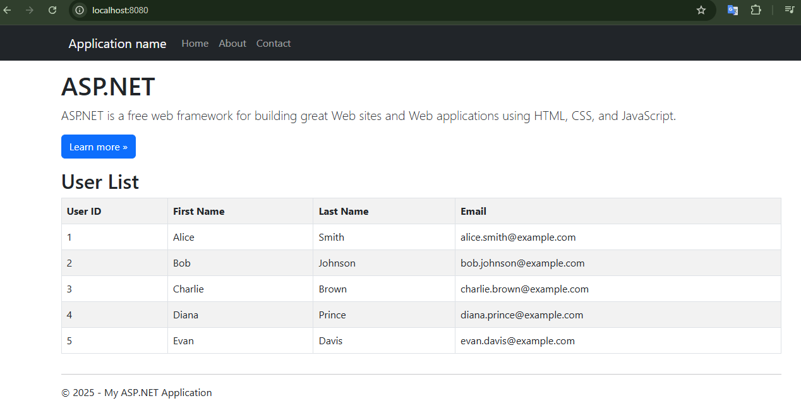

# Docker Web App
This is a simple ASP.NET Framework Web Application that displays a table with users from SQL Server database.

## Documentation
Full documentation can be found at [Docker Offline - How to containerize ASP.NET application](https://reedelsevier-my.sharepoint.com/:w:/r/personal/osypovay_science_regn_net/Documents/Documents/Elsevier/JPOC/Docker%20offline/Docker%20Offline.docx?d=wb2b34869ca2a4b4f83e389fbb32a95df&csf=1&web=1&e=hC8rgt&nav=eyJoIjoiMTI4NjQwNTAwOCJ9).

### Screenshots
